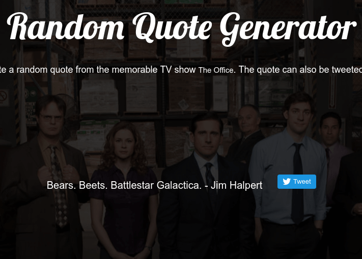

# The Office Random Quote Generator

## Description

This application generates a random quote from the hit TV show The Office. when the quote section is clicked. It also creates a Tweet button that allows the user to tweet out the quote to their followers. The Twitter API is used to accomplish this and documentation can be found

## Live Demo
       
https://coymeetsworld.github.io/the-office-random-quote-generator

  

## About

The Office Random Quote Generator was written by Coy Sanders as a requirement in the [Intermediate Front-End Development Projects](https://www.freecodecamp.com/challenges/build-a-random-quote-machine) for [FreeCodeCamp](https://www.freecodecamp.com) to earn the Front-End Development Certification.

software is licensed under the 

Copyright (c) 2017 
